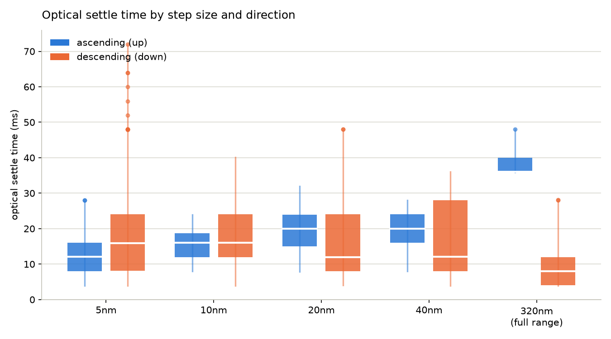

# VariSpec LCTF optical settle-time analysis

Empirical analysis of `illumination_probe.py`'s tab 6 (optical transition batch sweep)
results, run against the real VariSpec VIS filter (400-720nm, serial 52366) on
2026-08-07. Produced to inform the `settle_time_ms()` calibration decision in
`docs/architecture/general/lspri_acq_architecture_and_shared_shell_plan.md` §6.2,
which currently plans to hardcode a flat 50ms (VIS) constant.

## Data

792 transitions total, all optically measured (90%-rise time at the destination
wavelength's spectrometer pixel — see `measure_transition()` in
`illumination_probe.py`), zero error codes:

| Source file | Step size | Range | Repeats | Directions | n |
|---|---|---|---|---|---|
| `transition_batch_summary_20260807_150606.csv` | 5nm | 400-720nm | 3 | up + down | 384 |
| `transition_batch_summary_20260807_151407.csv` | 10nm | 400-720nm | 3 | up + down | 192 |
| `transition_batch_summary_20260807_151804.csv` | 20nm | 400-720nm | 3 | up + down | 96 |
| `transition_batch_summary_20260807_151941.csv` | 40nm | 400-720nm | 5 | up + down | 80 |
| `transition_batch_summary_20260807_152148.csv` | 320nm | 400↔720nm | 10 | up + down | 20 |
| `transition_batch_summary_20260807_152245.csv` | 320nm | 400↔720nm | 10 | up + down | 20 |

All six files are preserved in `spikes/lspri_acq_phase0/illumination_probe_results/`.
The two 320nm files are independent replicate runs of the same experiment (kept
separate to check repeatability — see below).

Box = IQR (25th-75th percentile), white line = median, whiskers = 1.5×IQR, dots =
points beyond that.

## Finding 1 — direction matters, but "up is faster" is not a universal rule

At **5nm steps**, down is measurably slower than up (Mann-Whitney U, p=1.4×10⁻⁴),
but mostly in the tail: median is only ~4ms slower (16.0 vs 12.0ms), while p99/max
are far worse (64/72ms vs 24/28ms).

At **10, 20, and 40nm steps**, the up/down difference is **not statistically
significant** (p=0.10-0.40), and where there's a trend it **reverses sign**
(down's median becomes slightly lower than up's at 20 and 40nm).

At the **full 320nm range jump (400↔720nm)**, direction dominates completely, in
the *opposite* direction from the 5nm case:

| Direction | Median | Range | n |
|---|---|---|---|
| 400 → 720nm (up) | 36-40ms (two runs) | 35.9-48.0ms | 20 |
| 720 → 400nm (down) | 7-10ms (two runs) | 4.0-28.1ms | 20 |

Mann-Whitney U, **p = 6.7×10⁻⁸**, rank-biserial r = −1.00 (the two distributions
do not overlap at all), reproduced consistently across two independent 10-repeat
runs (run 1: up mean 37.2ms / down mean 9.0ms; run 2: up mean 40.2ms / down mean
10.4ms).

**Conclusion**: direction is a real effect, but it is tied to the specific jump,
not a fixed "ascending is always faster/slower" rule. Speculative and unconfirmed:
this may reflect the LC's asymmetric relaxation physics (the manual describes
response time as relaxation from "charge" to "no charge" states, not necessarily
symmetric) tied to absolute retardance level rather than step direction per se.

## Finding 2 — a magnitude-only two-tier split (small vs. big jump) does not hold up

Pooling both directions, "small" (5-40nm) vs. "big jump" (320nm) is **not
significant** (Mann-Whitney p=0.066) — because "big jump" isn't one population,
it's two very different ones (36-40ms up, 7-10ms down) that cancel out when
pooled together. Splitting by **direction** is what actually separates the data,
not splitting by magnitude.

Within 5-40nm, step size itself is a weak predictor of settle time (Spearman
ρ=+0.16, p=1×10⁻⁵ — significant only because of the large sample size; the
medians aren't even monotonic: 40nm's median is *lower* than 20nm's). Below
40nm, direction and position matter more than how big the step is.

## Finding 3 — busy-check under-reports real settling in a meaningful fraction of cases

Fraction of transitions where the optically-measured settle time exceeded the
busy-check-reported settle time (busy-check said "idle" while the spectrum was
still genuinely changing):

| Step | Under-report rate | Mean excess (when it happens) | Max excess |
|---|---|---|---|
| 5nm | 7.3% | 12.9ms | 40.0ms |
| 10nm | 6.2% | 4.0ms | 8.1ms |
| 20nm | 7.3% | 7.5ms | 16.1ms |
| 40nm | 5.0% | 3.0ms | 4.0ms |
| 320nm | **50.0%** | 6.7ms | 16.0ms |

Note busy-check itself is still floor-limited to ~32ms on this machine by the
FTDI USB-serial latency timer (Device Manager > Ports > [port] > Advanced >
Latency Timer, not yet changed from the Windows default) — see the module
docstring in `illumination_probe.py`. That floor is exactly why the 320nm-up
case (optically 36-48ms, i.e. often above the ~32ms busy-check ceiling) shows
the highest under-report rate.

## Recommended settle-time margins

p99 and max from this dataset, if calibrating a real `settle_time_ms()`:

| Tier | n | p99 | max observed | suggested margin |
|---|---|---|---|---|
| Single global constant (covers everything) | 792 | 48.0ms | 72.0ms | ~80-90ms |
| Small step, ascending (5-40nm, up) | 376 | 28.0ms | 32.0ms | ~35-40ms |
| Small step, descending (5-40nm, down) | 376 | 57.0ms | 72.0ms | ~80ms |
| Full-range jump, ascending (400→720) | 20 | 47.2ms | 48.0ms | ~55ms |
| Full-range jump, descending (720→400) | 20 | 28.1ms | 28.1ms | ~35ms |

**Recommendation**: a direction-aware two-value model (not size-based) captures
most of the achievable benefit. A single flat constant safe for everything needs
~72-90ms; tiering by direction gets ascending moves down to ~35-40ms — a genuine
~50-55% reduction for what's probably the common case (a sweep stepping
consistently in one direction). Descending small steps don't benefit from
tiering by size — that tier is the real worst-case tail regardless, and needs
the larger margin either way.

## Caveats

- All settle times are a 90%-rise estimate from the destination-wavelength
  pixel, not verified full (99-100%) settling — `estimate_rise_time_ms()` in
  `illumination_probe.py` is explicitly documented as "a simple honest
  estimate," not a substitute for inspecting the raw curve.
- No raw per-frame data was saved for these runs (`save_full_frames` was off in
  the UI), so the 90%-rise numbers can't be independently re-checked against
  the actual intensity-vs-time curves.
- The down/small-step heavy tail (up to 72ms at 5nm) could be partly a real
  physical effect and partly a measurement-noise artifact: a small step means a
  small fractional intensity change at the destination pixel, which makes the
  90%-rise threshold crossing more sensitive to frame-to-frame noise. This
  can't be separated from the physical effect without the raw curves.
- If a tighter, more defensible number is needed for the real driver: re-run
  the 320nm up-vs-down comparison (the cleanest, most trustworthy result here)
  and a handful of small-step down cases with "save full frame data" enabled,
  so the estimate can be checked against the actual curves rather than trusted
  as pre-computed.
